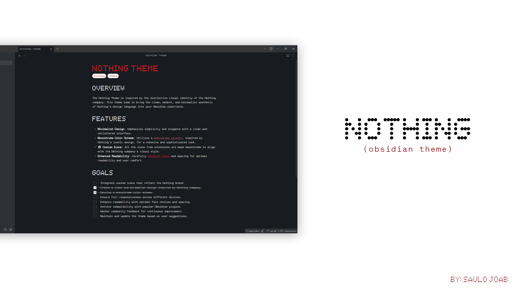
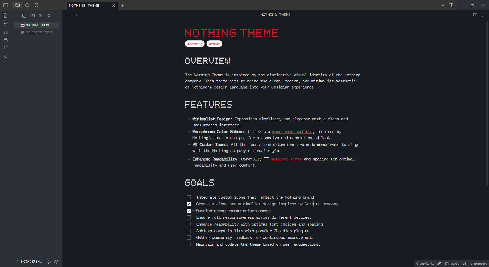
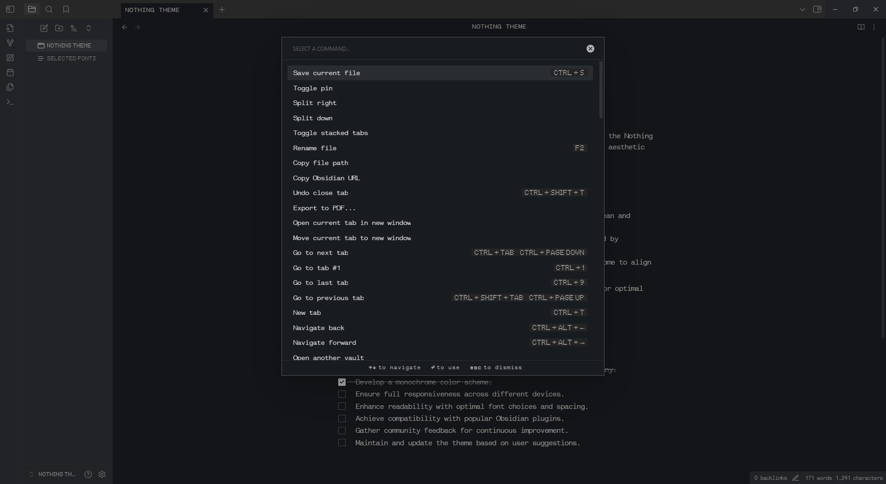
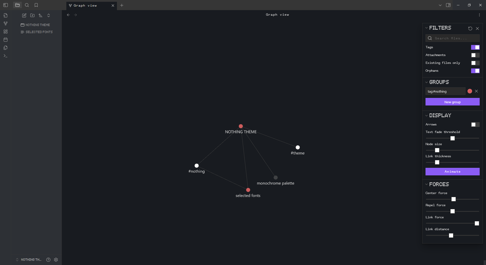
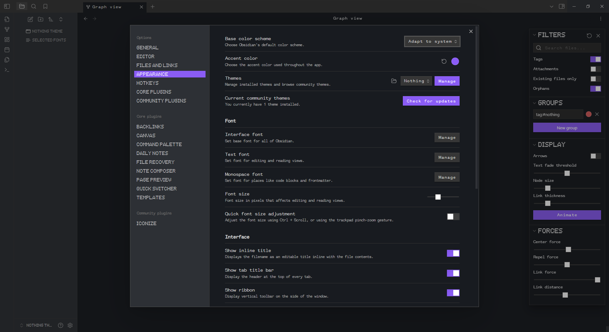

<div align="center">
<samp><h1>Obsidian Nothing Theme</h1></samp>
</div>

<samp>The Obsidian Nothing Theme is inspired by the distinctive visual identity of the Nothing company. This theme aims to bring the clean, modern, and minimalist aesthetic of Nothing's design language into your Obsidian experience.</samp>

## <samp>Screenshots</samp>






## <samp>Installation</samp>

<samp>To install, just download this repository, add it to a folder called "Nothing" and add them to the following path:</samp>

```
yourVault/.obsidian/themes
```

-   <samp>The only needed files are manifest.json and theme.css, you can delete the other ones.</samp>
